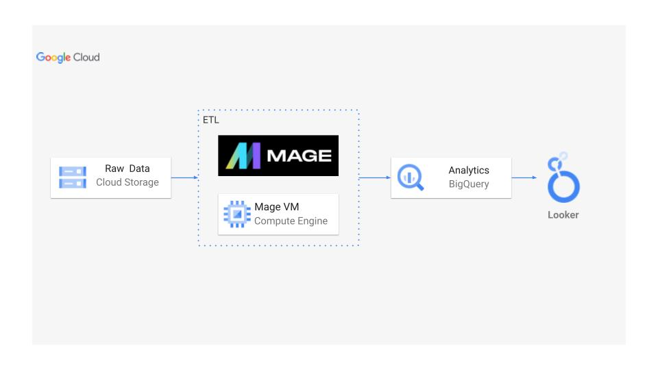
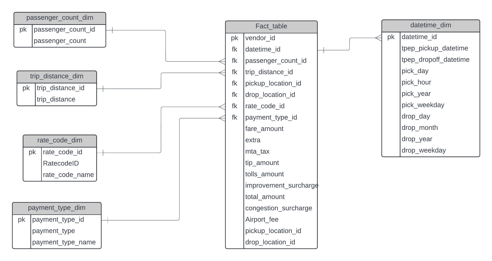

# 🚖🚖 UBER Data Engineering Project 🚕🚕 | Modern Engineering Project with GCP

## Overview

This project delves into the world of Uber data analytics by employing modern data engineering practices on the Google Cloud Platform (GCP). 
It focuses on building an efficient ETL pipeline using Mage.ai, managing data with BigQuery and Cloud Storage, and visualizing insights using Looker Studio. 
This project aims to showcase how powerful and scalable cloud-based tools can be leveraged to extract, transform, and analyze large datasets.

## Project Architecture



### Technologies Used

- Programming Language: Python
- Scripting Language: SQL
- Google Cloud Platform Services:
  - BigQuery: Data warehousing and analytics.
  - Cloud Storage: Data storage and management.
  - Compute Instance: For running computations and processes.
  - Looker Studio: Data visualization and reporting.
- Data Pipeline Tool: Mage.ai (Modern ETL and data pipeline tool)

### Dataset Used

TLC Trip Record Data:
  - Yellow and green taxi trip records, including:
    - Pick-up and drop-off dates/times
    - Trip distances
    - Itemized fares
    - Rate types
    - Payment types
    - Driver-reported passenger counts
   
### Data Model



### Project Structure

```
.
├── src/
│   ├── code.ipynb                               # Jupyter Notebook, which I used in local system
│   ├── analytics.sql                            # SQL script for data transactions
│   └── commands.txt                             # Commands, which are used in GCP to install and access Mage-ai tool
│   └── uber data model.png/                     # Database design file
│   └── architecture.png/                        # Project Architecture file
│   └── data_dictionary.pdf/                     # Data dictionary file
├── mage-files/
│   └── extractor.py/                            # Data retriving file from GCP
│   └── data_loader.py/                          # Data exporting file to Big_query
│   └── transformation.py/                       # Data transformation file
└── README.md                                    # Project documentation

```

### More Information abour Dataset

- Original Source: https://www.nyc.gov/site/tlc/about/tlc-trip-record-data.page

### Contributing
I welcome contributions to enhance this project! Feel free to fork the repository, create a new branch, and submit a pull request.

### Contact
For any questions or support, please open an issue on this repository or reach out via email at kenilsutariya030@gmail.com

